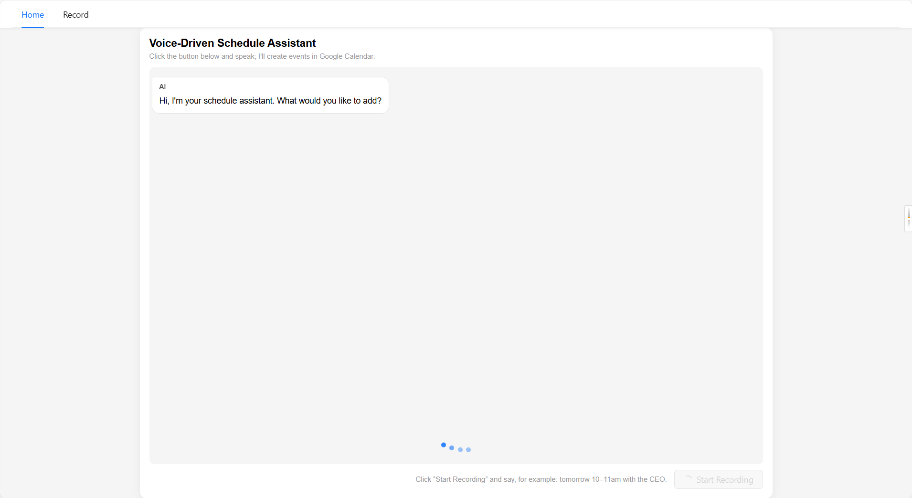
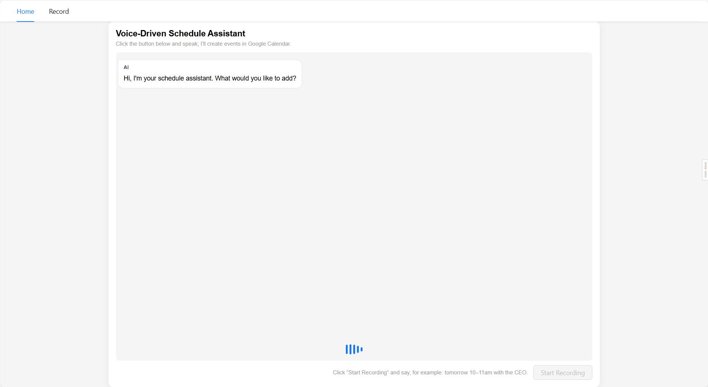
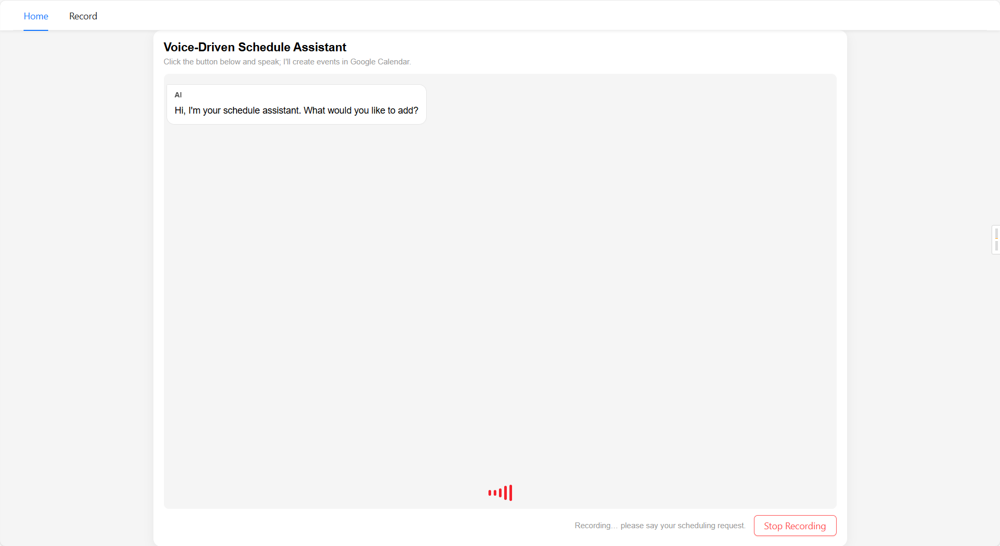

# voice-assistant

[English README](README.md)

语音驱动的日程助手（Google Calendar 自动化）。

本项目实现了一个 **语音驱动的智能日程助手 Web 应用**：
- 前端点击 **开始语音对话** 后录音
- 音频识别 → 解析为日程指令 → Playwright 自动化 Google Calendar 创建事件

## 环境配置

### 前端

`node` v20.19.5

```bash
cd Frontend
npm i
```

### 后端

`Python` 3.10.11

```bash
pip install fastapi uvicorn[standard] python-multipart faster-whisper edge-tts opencc-python-reimplemented dateparser playwright
```

安装浏览器：

```bash
python -m playwright install chromium
```

之后移动 `chrome-win` 到 `Backend\tools` 文件夹。

## 总览

```
Frontend/
  src/
    pages/Home/         # 语音对话页面
    utils/              # Axios 封装
    router/             # React Router
    styles/             # 全局 SCSS 变量
Backend/
  main.py               # FastAPI 主程序
  tools/
    speech.py           # Whisper STT + TTS
    nlp.py              # NLP 解析
    calendar_agent.py   # Playwright 自动化
    file_utils.py       # 临时文件保存
    models.py           # 数据模型
    chrome_profile/     # 登录态持久化
    chrome-win/         # portable Chrome
```

### 前端（React + Vite + AntD）

- **入口**：`main.jsx`
- **路由**：`App.jsx` + `router/routes.jsx`
- **Home 页面**：`pages/Home/index.jsx`
- **HTTP 封装**：
  - `request.js`：axios 实例 + 拦截器 + 通用错误提示
  - `http.js`：封装 `get/post/put/delete`
  - `api.js`：前端直接 `postAPI("/voice", formData)`
- **Vite 代理**：`vite.config.js`
- **全局样式变量**：`src/styles/variables.scss`

### 后端（FastAPI + Whisper + Edge TTS + Playwright）

- **入口**：`Backend/main.py`
  - FastAPI 应用 + CORS（允许 `http://localhost:5173`）
- **语音模块**：`tools/speech.py`
  - Whisper `small`，`device="cpu"`，`compute_type="int8"`
  - OpenCC `t2s` 简繁转换
  - TTS 使用 `edge_tts`，支持中英音色与自动 fallback
- **NLP 解析**：`tools/nlp.py`
  - 中英文日期/时间解析
- **Google Calendar Agent**：`tools/calendar_agent.py`
  - Playwright + 本地 Chrome
  - 使用 `chrome_profile` 持久化登录态
  - 支持中英文时间 label（如“下午10点 - 下午11点”，“10am to 11am”）
- **数据模型**：`tools/models.py`

## 功能点

### 1. 前端

#### 中英双语支持

前端 UI、日志、报错、NLP 解析

#### 等待动画







### 2. 语音交互流程

- 点击按钮开始语音对话
- 后端作为“语音应答 Bot”
- 首次连线播报固定开场白
- 用户说话，系统解析并回复

### 3. Google 日历操作

- Playwright 浏览器自动化
- 后端打开 Calendar 页面并创建事件

### 4. 登录与会话保持

- 不使用 Google Calendar API，仅 UI 自动化
- 第一次运行：打开真实浏览器，用户手动登录 + MFA
- 登录成功后复用登录态

### 5. 冲突检测与创建

- 解析语音中的日期与时间
- 冲突时提示；空闲则创建

## 运行

前端：

```bash
cd Frontend
npm run dev
```

后端：

```bash
cd Backend
python main.py
```

打开 `http://localhost:5173`

点击 **开始语音对话**。


开场白结束后开始录音，结束后点击 **停止录音**。


程序自动打开浏览器写入日程：


若是第一次登录，请在打开的浏览器中完成登录。

如有冲突会返回冲突提示：


## 已知问题与限制

### Google 登录需手动完成

- 目前无法自动化 MFA。

### Playwright 受网络波动影响

- 网络慢会导致 Calendar 加载延迟。
- 已做超时处理，但仍可能受网络影响。

### Whisper small 在 CPU 上较慢

- 低配机器会更明显。
- 可切换 `distil` 或 `tiny` 模型。

### NLP 不等于强语义理解

- 组合语句有限。
- 可接入 LLM 增强语义解析。

### 日程只支持单日

- 暂不支持跨日事件。
- 预留接口待扩展。

### 历史记录

- 暂无日志 UI，预留 Record 页。

## 仓库地址

- GitHub: https://github.com/Jayden3422/voice-assistant
